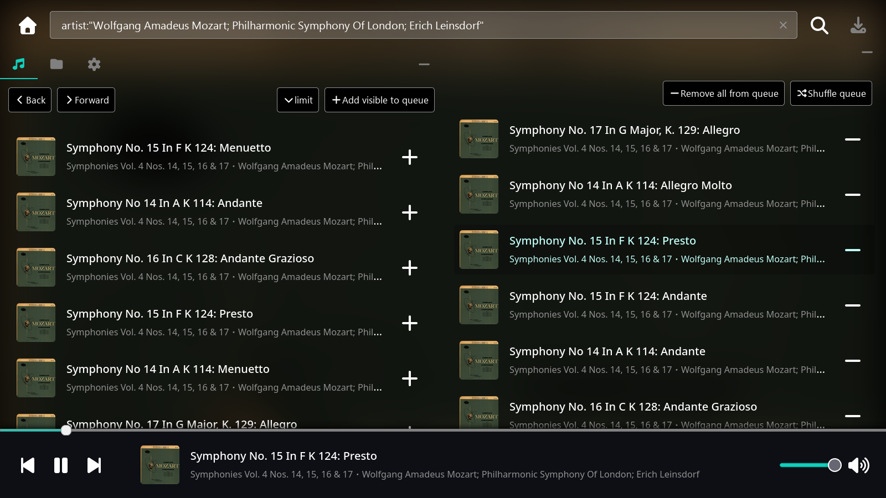
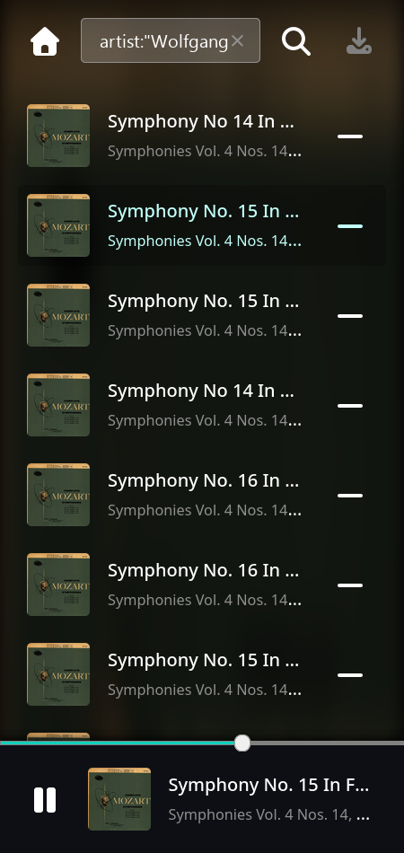

#  musicserver

A minimal, cross-platform music server.

This is my personal project. Do not expect any updates or support.

<table>
  <tr>
    <td>
      <p></p>
      <p><em>Desktop</em></p>
    </td>
    <td>
      <p></p>
      <p><em>Phone</em></p>
    </td>
  </tr>
</table>

## Features

- Manages your music library as a database for a single directory
- Database searching with query syntax inspired by web search engines
- Responsive design, tested in landscape and portrait resolutions
- Filter, queue and listen to specific tracks
- Touch navigation by swiping left and right on the music player
- OS integration through media session support
- Server written in Go, compiles to a single binary
- Client written in React, Typescript
- Includes Android support by compiling server as a dynamic library

## Running

musicserver expects a config file. See the [internal/schema/config.go](internal/schema/config.go) file for information. Pass it in using the `-config` parameter:

```sh
musicserver -config ~/.config/musicserver.yaml
```

The Android version does not support custom server configurations. The data path is always set to the user's Music directory.

## Building

Ensure that this directory was cloned recursively, with all of its git submodules.

You must have npm installed. After which, cd into the frontend directory and get the build dependencies.

### Server

Use the provided Makefile which compiles the server to `build/musicserver`:

```sh
make
```

### Android

Currently supports Android 13 and above (API 33).

You must have [sdkmanager](https://developer.android.com/tools/sdkmanager) installed. Set the `ANDROID_HOME` environemnt variable to your path of choice, and get the required dependencies with:

```
sdkmanager --sdk_root=$ANDROID_HOME "platform-tools" "build-tools;33.0.2" "platforms;android-33" "cmdline-tools;latest" "ndk;27.3.13750724"
```

Then in the `android` directory, run the Makefile. You may be asked to enter information for the APK signing keys.

Once complete, the final apk will be in `build/org.msxrv.musicserver.apk`

## License

MIT License.

Includes code generated by large language models, checked by a human. Refer to the git log for details.

